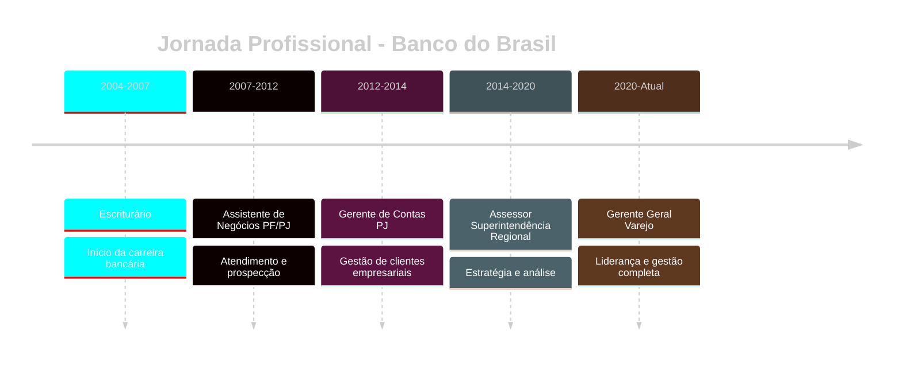

<div align="center">


</div>

<div align="center">

[](https://git.io/typing-svg)

</div>


##  Sobre Mim

```typescript
const joseRoberto = {
    nome: "José Roberto Ramos dos Santos Filho",
    cargo: "Gerente Geral de Agência Varejo",
    empresa: "Banco do Brasil",
    experiencia: "20+ anos no setor bancário",
    status: "Casado, pai, dedicado à família e carreira",
    
    atualmente_aprendendo: ["Python", "JavaScript", "IA", "Data Science"],
    
    especialidades: {
        gestao: ["Liderança", "Estratégia", "Resultados"],
        financeiro: ["Carteiras", "Crédito PJ", "Investimentos"],
        tech: ["Full Stack", "Análise de Dados", "Automação"]
    },
    
    mindset: "Transformando desafios em oportunidades",
    missao: "Integrar gestão tradicional com inovação tecnológica"
};
```

<div align="center">

[](https://git.io/typing-svg)

</div>


##  Tech Stack

<div align="center">

<table>
<tr>
<td align="center" width="140" height="112.43">

<br /><strong>Python</strong>
</td>
<td align="center" width="140" height="112.43">

<br /><strong>HTML5</strong>
</td>
<td align="center" width="140" height="112.43">

<br /><strong>CSS3</strong>
</td>
<td align="center" width="140" height="112.43">

<br /><strong>JavaScript</strong>
</td>
<td align="center" width="140" height="112.43">

<br /><strong>Git</strong>
</td>
</tr>
<tr>
<td align="center" width="140" height="112.43">

<br /><strong>Streamlit</strong>
</td>
<td align="center" width="140" height="112.43">

<br /><strong>Pandas</strong>
</td>
<td align="center" width="140" height="112.43">

<br /><strong>NumPy</strong>
</td>
<td align="center" width="140" height="112.43">

<br /><strong>VS Code</strong>
</td>
<td align="center" width="140" height="112.43">

<br /><strong>GitHub</strong>
</td>
</tr>
</table>

</div>


##  Experiência Profissional

<div align="center">



</div>

<table align="center">
<tr>
<th>🗓️ Período</th>
<th>💼 Cargo</th>
<th>🎯 Foco</th>
</tr>
<tr>
<td><code>2020 - Atual</code></td>
<td><strong>Gerente Geral Varejo</strong></td>
<td>Liderança • Estratégia • Resultados</td>
</tr>
<tr>
<td><code>2014 - 2020</code></td>
<td><strong>Assessor Superintendência Regional</strong></td>
<td>Assessoria • Análise • Planejamento</td>
</tr>
<tr>
<td><code>2012 - 2014</code></td>
<td><strong>Gerente de Contas PJ</strong></td>
<td>Relacionamento • Crédito • Negócios</td>
</tr>
<tr>
<td><code>2007 - 2012</code></td>
<td><strong>Assistente de Negócios PF/PJ</strong></td>
<td>Atendimento • Prospecção • Carteiras</td>
</tr>
<tr>
<td><code>2004 - 2007</code></td>
<td><strong>Escriturário</strong></td>
<td>Operações • Administrativo • Processos</td>
</tr>
</table>


##  Formação & Certificações

<div align="center">

| 🎓 Curso | 🏛️ Instituição | 📅 Período | ✅ Status |
|:---------|:---------------|:-----------|:----------|
| **Bacharel em Administração** | UESC | 2003-2007 | ✔️ Concluído |
| **Pós-Graduação em Controladoria e Finanças** | FTC | 2016-2018 | ✔️ Concluído |
| **Programação Full Stack com IA** | Infinity School | 2024-2025 | 🔄 Em Andamento |
| **Certificação CPA 20** | Anbima | - | ✔️ Ativa |
| **Certificações de Negócios** | Fundação Cesgranrio | 2024 | ✔️ Aprovado |

</div>


##  Projetos em Destaque

<div align="center">

<table>
<tr>
<td width="50%">

### 📊 Dashboard Análise Salarial
**Área de Dados**

Projeto desenvolvido durante imersão Alura. Análise completa de tendências salariais no mercado brasileiro.

**Stack:** `Python` `Streamlit` `Pandas` `Plotly`

🔗 [Ver Projeto](#)

</td>
<td width="50%">

### 💹 Backtest Magic Formula
**Análise Financeira**

Imersão Varos - Análise comparativa de rentabilidade Magic Formula vs. Ibovespa.

**Stack:** `Python` `Finance` `Backtesting`

🔗 [Ver Projeto](#)

</td>
</tr>
<tr>
<td width="50%">

### 🌐 Infinity Minds
**Site Institucional**

Hackathon Infinity School - Site responsivo com tema futurista sobre IA.

**Stack:** `HTML5` `CSS3` `JavaScript`

🔗 [Ver Projeto](#)

</td>
<td width="50%">

### 🚀 Mais Projetos em Breve
**Em Desenvolvimento**

Novos projetos integrando IA, automação e análise de dados.

**Stack:** `Python` `AI` `ML`

🔗 [Ver GitHub](#)

</td>
</tr>
</table>

</div>


##  Habilidades

<div align="center">

### 💡 Soft Skills


### 🎯 Hard Skills


</div>


##  GitHub Analytics

<div align="center">


</div>

<div align="center">
  


</div>


##  Conecte-se Comigo

<div align="center">

[](https://linkedin.com/in/bettograpiuna)
[](https://github.com/bettograpiuna)
[](mailto:bettograpiuna@hotmail.com)
[](https://bettograpiuna.github.io/Portifolio2/)
[](https://wa.me/5573991124704)

### 📱 Telefone: (73) 99112-4704

</div>


<div align="center">

[](https://git.io/typing-svg)

<br>

###  *"Transformando desafios em oportunidades através da inovação e tecnologia"* 

<br>


<br>


</div>
