## `01` Sobre

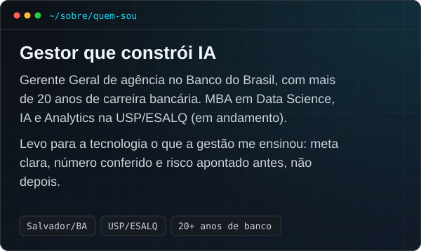 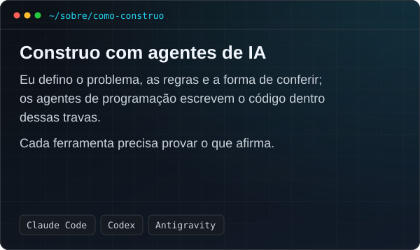 
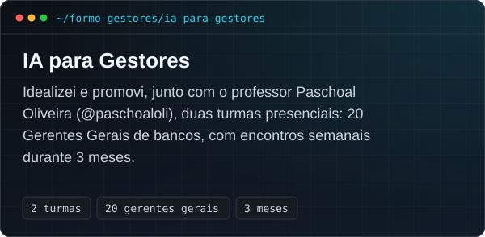 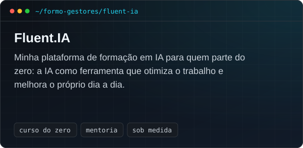

Parceria nas turmas de IA para Gestores: professor Paschoal Oliveira — [@paschoaloli](https://www.instagram.com/paschoaloli/) no Instagram.

## `02` O que estou construindo

Os repositórios são privados porque guardam dados de clientes e de pessoas. O código fica fechado; o que ele faz está nos cartões.

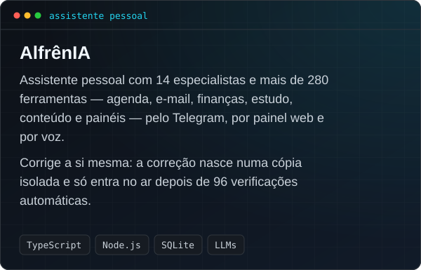 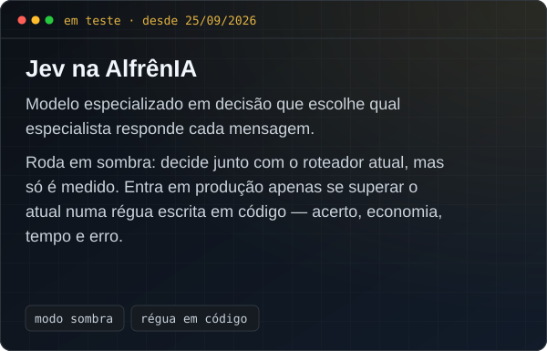 
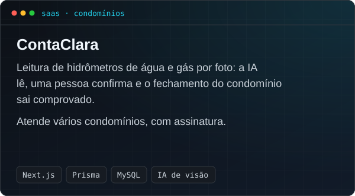 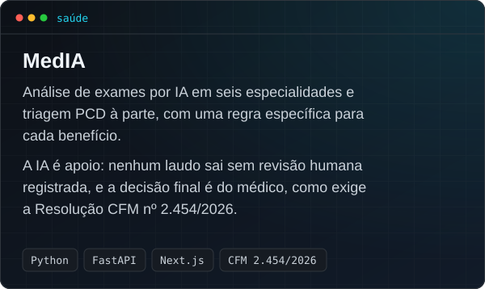 
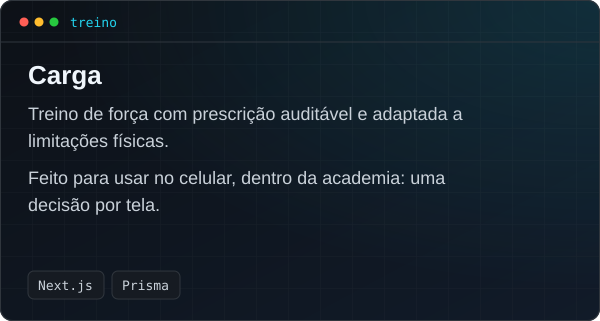 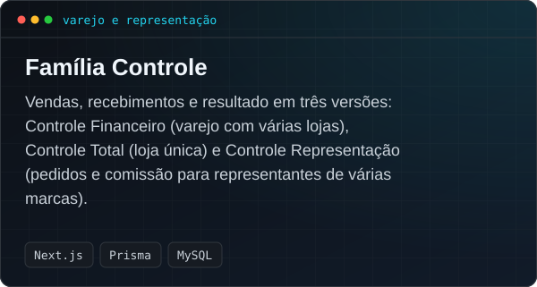 
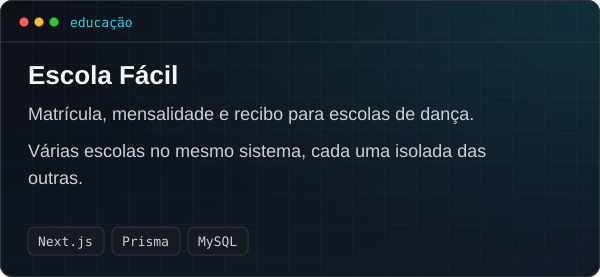 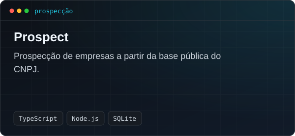

## `03` Como trabalho

Regra que vive só no prompt é sugestão: sob pressão, o modelo a abandona — e erra com a mesma convicção com que acerta. Por isso:

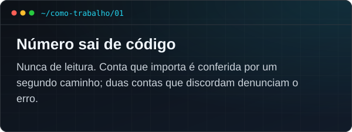 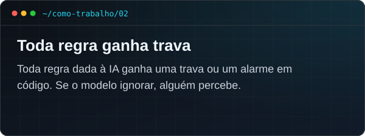 
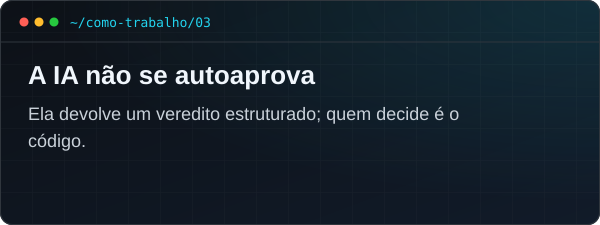 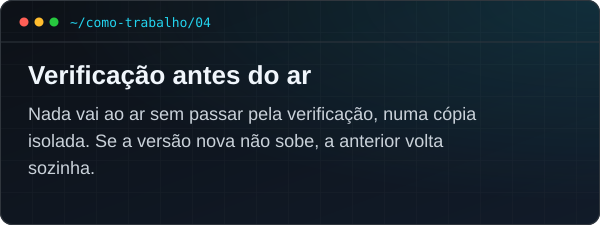

## `04` Tecnologia

**Agentes de IA** 
  

**Linguagens** 
  

**Web** 
     

**Dados** 
    

**IA** 
  

**Entrega** 
  

## `05` Trajetória e formação

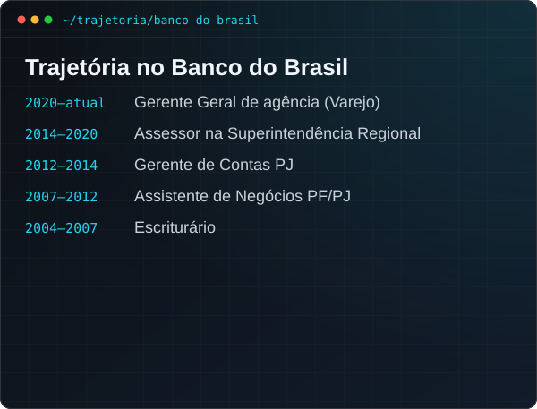 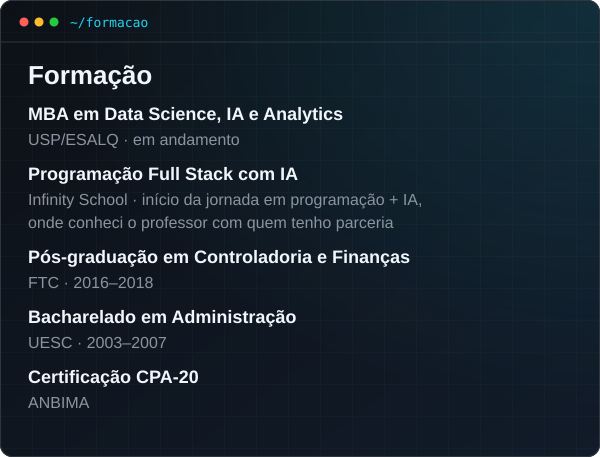

## `06` Contato

 
