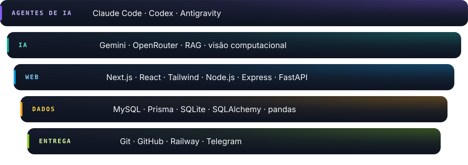

<picture>
  <source media="(max-width: 559px)" srcset="assets/v2/capa-celular.svg">
  <source media="(min-width: 768px) and (max-width: 900px)" srcset="assets/v2/capa-celular.svg">
  <source media="(max-width: 1279px)" srcset="assets/v2/capa-medio.svg">
  
</picture>

Sou Gerente Geral de agência no Banco do Brasil, com mais de 20 anos de carreira, e faço MBA em Data Science, IA e Analytics na USP/ESALQ. Construo com agentes de IA de programação: eu defino o problema, as regras e a forma de conferir; eles escrevem o código dentro dessas travas.

Também idealizei e promovi, junto com o professor Paschoal Oliveira ([@paschoaloli](https://www.instagram.com/paschoaloli/)), duas turmas presenciais de **IA para Gestores**: 20 Gerentes Gerais de bancos, com encontros semanais durante 3 meses. É o mesmo propósito da **Fluent.IA**, minha plataforma de formação em IA para quem parte do zero.

## Portfólio

<picture>
  <source media="(max-width: 559px)" srcset="assets/v2/portfolio-celular.svg">
  <source media="(min-width: 768px) and (max-width: 900px)" srcset="assets/v2/portfolio-celular.svg">
  <source media="(max-width: 1279px)" srcset="assets/v2/portfolio-medio.svg">
  
</picture>

Os repositórios são privados porque guardam alguns dados sensíveis. O código fica fechado; o que ele faz está aqui. Se algum projeto interessar, [entre em contato](#user-content-contato).

Ler os projetos em texto

| Projeto | O que resolve | Tecnologia |
|:--|:--|:--|
| **AlfrênIA** | Assistente pessoal com 14 especialistas e mais de 280 ferramentas — agenda, e-mail, finanças, estudo, produção de conteúdo e painéis — pelo Telegram, por um painel web e por voz. Corrige a si mesma: a correção nasce numa cópia isolada e só entra no ar depois de 96 verificações automáticas. | TypeScript · Node.js · SQLite · LLMs |
| **Jev (em teste)** | Desde 25/09/2026, um modelo especializado em decisão escolhe qual especialista da AlfrênIA responde cada mensagem. Roda em sombra: só é medido, e entra em produção apenas se superar o roteador atual numa régua escrita em código. | OpenRouter |
| **ContaClara** | Leitura de hidrômetros de água e gás por foto: a IA lê, uma pessoa confirma e o fechamento do condomínio sai comprovado. Vários condomínios, com assinatura. | Next.js · Prisma · MySQL · IA de visão |
| **MedIA** | Análise de exames por IA em seis especialidades e triagem PCD à parte. A IA é apoio: nenhum laudo sai sem revisão humana registrada, e a decisão final é do médico, como exige a Resolução CFM nº 2.454/2026. | Python · FastAPI · Next.js |
| **Carga** | Treino de força com prescrição auditável e adaptada a limitações físicas, feito para usar no celular, dentro da academia. | Next.js · Prisma |
| **Controle Financeiro · Total · Representação** | Vendas, recebimentos e resultado: varejo com várias lojas, loja única, e pedidos com comissão para representantes de várias marcas. | Next.js · Prisma · MySQL |
| **Escola Fácil** | Matrícula, mensalidade e recibo para escolas de dança, várias escolas no mesmo sistema, cada uma isolada das outras. | Next.js · Prisma · MySQL |
| **Prospect** | Prospecção de empresas a partir da base pública do CNPJ. | TypeScript · Node.js · SQLite |

## Método

<picture>
  <source media="(max-width: 559px)" srcset="assets/v2/metodo-celular.svg">
  <source media="(min-width: 768px) and (max-width: 900px)" srcset="assets/v2/metodo-celular.svg">
  <source media="(max-width: 1279px)" srcset="assets/v2/metodo-medio.svg">
  
</picture>

## Trajetória

<picture>
  <source media="(max-width: 559px)" srcset="assets/v2/trajetoria-celular.svg">
  <source media="(min-width: 768px) and (max-width: 900px)" srcset="assets/v2/trajetoria-celular.svg">
  <source media="(max-width: 1279px)" srcset="assets/v2/trajetoria-medio.svg">
  
</picture>

## Formação

- **MBA em Data Science, IA e Analytics** — USP/ESALQ (em andamento)
- **Programação Full Stack com IA** — Infinity School · início da jornada em programação + IA, onde conheci o professor com quem tenho parceria
- **Pós-graduação em Controladoria e Finanças** — FTC (2016–2018)
- **Bacharelado em Administração** — UESC (2003–2007)
- **Certificação CPA-20** — ANBIMA

## Stack

<picture>
  <source media="(max-width: 559px)" srcset="assets/v2/stack-celular.svg">
  <source media="(min-width: 768px) and (max-width: 900px)" srcset="assets/v2/stack-celular.svg">
  <source media="(max-width: 1279px)" srcset="assets/v2/stack-medio.svg">
  
</picture>

## Contato

&nbsp;&nbsp;
