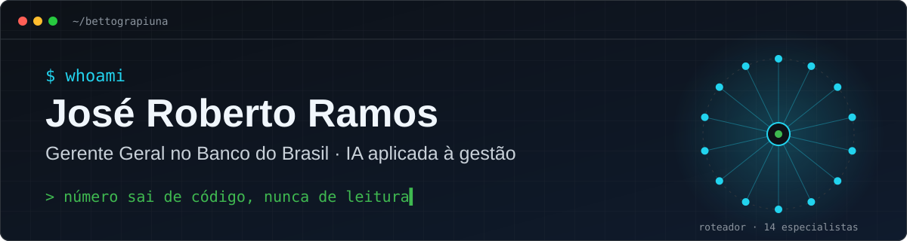

Salvador/BA · mais de 20 anos de carreira bancária · MBA em Data Science, IA e Analytics na USP/ESALQ (em andamento)

Levo para a tecnologia o que a gestão me ensinou: meta clara, número conferido e risco apontado antes, não depois. Desenho ferramentas de IA para problemas reais de gestão — e cada uma precisa provar o que afirma.

Construo com agentes de IA de programação: eu defino o problema, as regras e a forma de conferir; eles escrevem o código dentro dessas travas.

Idealizei e promovi, junto com o professor Paschoal Oliveira (@paschoaloli), duas turmas de **IA para Gestores**: 20 Gerentes Gerais de bancos, em turmas presenciais com encontros semanais durante 3 meses.

## `01` O que estou construindo

Os repositórios são privados porque guardam dados de clientes e de pessoas. O código fica fechado; o que ele faz está aqui.

| Projeto | O que resolve | Tecnologia |
|:--|:--|:--|
| **AlfrênIA** | Assistente pessoal com 14 especialistas e mais de 280 ferramentas — agenda, e-mail, finanças, estudo, produção de conteúdo e painéis — pelo Telegram, por um painel web e por voz. Corrige a si mesma: um incidente vira correção numa cópia isolada, que só entra no ar depois de passar por 96 verificações automáticas. | TypeScript · Node.js · SQLite · LLMs |
| **ContaClara** | Leitura de hidrômetros de água e gás por foto: a IA lê, uma pessoa confirma e o fechamento do condomínio sai comprovado. Atende vários condomínios, com assinatura. | Next.js · Prisma · MySQL · IA de visão |
| **MedIA** | Análise de exames por IA em seis especialidades e triagem PCD à parte, com uma regra específica para cada benefício. O que a IA extrai só vale depois que uma pessoa confirma. | Python · FastAPI · Next.js |
| **Carga** | Treino de força com prescrição auditável e adaptada a limitações físicas, feito para usar no celular, dentro da academia. | Next.js · Prisma |
| **Controle Financeiro · Total · Representação** | Vendas, recebimentos e resultado: varejo com várias lojas, loja única, e pedidos com comissão para representantes de várias marcas. | Next.js · Prisma · MySQL |
| **Escola Fácil** | Matrícula, mensalidade e recibo para escolas de dança, várias escolas no mesmo sistema. | Next.js · Prisma · MySQL |
| **Prospect** | Prospecção de empresas a partir da base pública do CNPJ. | TypeScript · Node.js · SQLite |

> [!NOTE]
> **Em teste agora: o Jev na AlfrênIA.** Desde 25/09/2026 a AlfrênIA testa o Jev, um modelo especializado em decisão, para escolher qual especialista responde cada mensagem. Ele roda **em sombra**: decide junto com o roteador atual, mas quem manda continua sendo o roteador — o Jev só é medido. Ele entra em produção apenas se superar o atual numa régua escrita em código (acerto, economia, tempo de resposta e taxa de erro), não por impressão.

## `02` Como trabalho

Regra que vive só no prompt é sugestão: sob pressão, o modelo a abandona — e erra com a mesma convicção com que acerta. Por isso:

- **Número sai de código, nunca de leitura.** Conta que importa é conferida por um segundo caminho; duas contas que discordam denunciam o erro.
- **Toda regra dada à IA ganha uma trava ou um alarme em código.** Se o modelo ignorar, alguém percebe.
- **A IA não se autoaprova.** Ela devolve um veredito estruturado; quem decide é o código.
- **Nada vai ao ar sem passar pela verificação**, numa cópia isolada. Se a versão nova não sobe, a anterior volta sozinha.

## `03` Tecnologia

**Linguagens** 
  

**Web** 
     

**Dados** 
    

**IA** 
  

**Entrega** 
  

## `04` Trajetória no Banco do Brasil

| Período | Cargo |
|:--|:--|
| 2020 – atual | Gerente Geral de agência (Varejo) |
| 2014 – 2020 | Assessor na Superintendência Regional |
| 2012 – 2014 | Gerente de Contas PJ |
| 2007 – 2012 | Assistente de Negócios PF/PJ |
| 2004 – 2007 | Escriturário |

## `05` Formação

- **MBA em Data Science, IA e Analytics** — USP/ESALQ (em andamento)
- **Programação Full Stack com IA** — Infinity School
- **Pós-graduação em Controladoria e Finanças** — FTC (2016–2018)
- **Bacharelado em Administração** — UESC (2003–2007)
- **Certificação CPA-20** — ANBIMA

## `06` Contato

 
