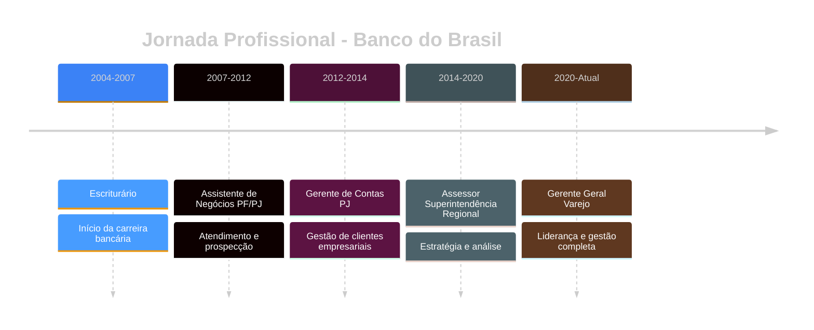

<div align="center">


</div>

<div align="center">

[](https://git.io/typing-svg)

</div>

<p align="center">
  
</p>

##  Sobre Mim

```typescript
const joseRoberto = {
    nome: "José Roberto Ramos dos Santos Filho",
    cargo: "Gerente Geral de Agência Varejo",
    empresa: "Banco do Brasil",
    experiencia: "20+ anos no setor bancário",
    
    mindset: [
        "Lifelong Learning",
        "Sempre aprendendo, inovando e implementando melhorias",
        "Integrando tecnologia na gestão tradicional"
    ],
    
    atualmente_aprendendo: ["Python", "JavaScript", "IA", "Data Science", "Automação"],
    
    especialidades: {
        gestao: ["Liderança", "Estratégia", "Resultados", "Inovação"],
        financeiro: ["Carteiras", "Crédito PJ", "Investimentos", "Análise"],
        tech: ["Full Stack", "Data Analysis", "Automation", "AI Integration"]
    },
    
    objetivo: "Transformar gestão bancária com tecnologia e inovação"
};
```

<div align="center">

[](https://git.io/typing-svg)

</div>

<p align="center">
  
</p>

##  Tech Stack

<div align="center">

<table>
<tr>
<td align="center" width="140" height="112">

<br /><strong>Python</strong>
</td>
<td align="center" width="140" height="112">

<br /><strong>HTML5</strong>
</td>
<td align="center" width="140" height="112">

<br /><strong>CSS3</strong>
</td>
<td align="center" width="140" height="112">

<br /><strong>JavaScript</strong>
</td>
<td align="center" width="140" height="112">

<br /><strong>Git</strong>
</td>
</tr>
<tr>
<td align="center" width="140" height="112">

<br /><strong>Streamlit</strong>
</td>
<td align="center" width="140" height="112">

<br /><strong>Pandas</strong>
</td>
<td align="center" width="140" height="112">

<br /><strong>NumPy</strong>
</td>
<td align="center" width="140" height="112">

<br /><strong>VS Code</strong>
</td>
<td align="center" width="140" height="112">

<br /><strong>GitHub</strong>
</td>
</tr>
</table>

</div>

<p align="center">
  
</p>

##  Experiência Profissional

<div align="center">


```mermaid
%%{init: {'theme':'dark', 'themeVariables': { 'primaryColor':'#3B82F6','primaryTextColor':'#FFFFFF','primaryBorderColor':'#2563EB','lineColor':'#F97316','secondaryColor':'#1e3a8a','tertiaryColor':'#1e40af','fontSize':'16px'}}}%%
timeline
    title Jornada Profissional - Banco do Brasil
    2004-2007 : Escriturário
              : Início da carreira bancária
    2007-2012 : Assistente de Negócios PF/PJ
              : Atendimento e prospecção
    2012-2014 : Gerente de Contas PJ
              : Gestão de clientes empresariais
    2014-2020 : Assessor Superintendência Regional
              : Estratégia e análise
    2020-Atual : Gerente Geral Varejo
               : Liderança e gestão completa
```

</div>

<table align="center">
<tr>
<th>🗓️ Período</th>
<th>💼 Cargo</th>
<th>🎯 Foco</th>
</tr>
<tr>
<td><code>2020 - Atual</code></td>
<td><strong>Gerente Geral Varejo</strong></td>
<td>Liderança • Estratégia • Resultados</td>
</tr>
<tr>
<td><code>2014 - 2020</code></td>
<td><strong>Assessor Superintendência Regional</strong></td>
<td>Assessoria • Análise • Planejamento</td>
</tr>
<tr>
<td><code>2012 - 2014</code></td>
<td><strong>Gerente de Contas PJ</strong></td>
<td>Relacionamento • Crédito • Negócios</td>
</tr>
<tr>
<td><code>2007 - 2012</code></td>
<td><strong>Assistente de Negócios PF/PJ</strong></td>
<td>Atendimento • Prospecção • Carteiras</td>
</tr>
<tr>
<td><code>2004 - 2007</code></td>
<td><strong>Escriturário</strong></td>
<td>Operações • Administrativo • Processos</td>
</tr>
</table>

<p align="center">
  
</p>

##  Formação & Certificações

<div align="center">

| 🎓 Curso | 🏛️ Instituição | 📅 Período | ✅ Status |
|:---------|:---------------|:-----------|:----------|
| **Bacharel em Administração** | UESC | 2003-2007 | ✔️ Concluído |
| **Pós-Graduação em Controladoria e Finanças** | FTC | 2016-2018 | ✔️ Concluído |
| **Programação Full Stack com IA** | Infinity School | 2024-2025 | 🔄 Em Andamento |
| **Certificação CPA 20** | Anbima | - | ✔️ Ativa |
| **Certificações de Negócios** | Fundação Cesgranrio | 2024 | ✔️ Aprovado |

</div>

<p align="center">
  
</p>

##  Projetos em Destaque

<div align="center">

<table>
<tr>
<td width="50%">

### 📊 Dashboard Análise Salarial
**Área de Dados**

Projeto desenvolvido durante imersão Alura. Análise completa de tendências salariais no mercado brasileiro.

**Stack:** `Python` `Streamlit` `Pandas` `Plotly`

🔗 [Ver Projeto](#)

</td>
<td width="50%">

### 💹 Backtest Magic Formula
**Análise Financeira**

Imersão Varos - Análise comparativa de rentabilidade Magic Formula vs. Ibovespa.

**Stack:** `Python` `Finance` `Backtesting`

🔗 [Ver Projeto](#)

</td>
</tr>
<tr>
<td width="50%">

### 🌐 Infinity Minds
**Site Institucional**

Hackathon Infinity School - Site responsivo com tema futurista sobre IA.

**Stack:** `HTML5` `CSS3` `JavaScript`

🔗 [Ver Projeto](#)

</td>
<td width="50%">

### 🚀 Mais Projetos em Breve
**Em Desenvolvimento**

Novos projetos integrando IA, automação e análise de dados.

**Stack:** `Python` `AI` `ML`

🔗 [Ver GitHub](#)

</td>
</tr>
</table>

</div>

<p align="center">
  
</p>

##  Habilidades

<div align="center">

### 💡 Soft Skills


### 🎯 Hard Skills


</div>

<p align="center">
  
</p>

##  GitHub Analytics

<div align="center">


</div>

<div align="center">
  


</div>

<p align="center">
  
</p>

##  Conecte-se Comigo

<div align="center">

[](https://linkedin.com/in/bettograpiuna)
[](https://github.com/bettograpiuna)
[](mailto:bettograpiuna@hotmail.com)
[](https://bettograpiuna.github.io/Portifolio2/)

</div>

<p align="center">
  
</p>

<div align="center">

[](https://git.io/typing-svg)

<br>

###  *"Lifelong Learning: Sempre aprendendo, inovando e implementando melhorias"* 

<br>


<br>


</div>
